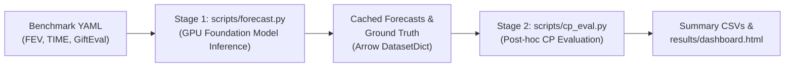

# `timecp`: Conformal Prediction Toolkit for Time Series Foundation Models

`timecp` is a modular, high-performance Python toolkit designed for uncertainty quantification in time series forecasting. It integrates pre-trained Time Series Foundation Models (TSFMs) with distribution-free Conformal Prediction (CP) algorithms, supporting both marginal (per-horizon) and joint (simultaneous multi-horizon) prediction intervals, symmetric and asymmetric error tracking, and a wide array of nonconformity score functions.

---

## Table of Contents

- [`timecp`: Conformal Prediction Toolkit for Time Series Foundation Models](#timecp-conformal-prediction-toolkit-for-time-series-foundation-models)
  - [Table of Contents](#table-of-contents)
  - [Package Architecture](#package-architecture)
  - [Supported Foundation Models](#supported-foundation-models)
  - [Forecaster API](#forecaster-api)
    - [Basic Usage](#basic-usage)
    - [Batched Inference](#batched-inference)
    - [Quantile and Point Forecasts](#quantile-and-point-forecasts)
    - [FEV Integration](#fev-integration)
  - [Conformal Prediction Methods](#conformal-prediction-methods)
    - [Base Interfaces](#base-interfaces)
      - [1. \[`ConformalPredictor`\](file:///c:/Users/nikos/Desktop/timecp-final/src/timecp/base.py) (Marginal Per-Horizon Interface)](#1-conformalpredictorfilecusersnikosdesktoptimecp-finalsrctimecpbasepy-marginal-per-horizon-interface)
      - [2. \[`JointPredictor`\](file:///c:/Users/nikos/Desktop/timecp-final/src/timecp/base.py) (Joint Simultaneous-Coverage Interface)](#2-jointpredictorfilecusersnikosdesktoptimecp-finalsrctimecpbasepy-joint-simultaneous-coverage-interface)
    - [Asymmetric Prediction Intervals](#asymmetric-prediction-intervals)
      - [Key Differences Between Modes](#key-differences-between-modes)
      - [Code Example: Asymmetric Calibration](#code-example-asymmetric-calibration)
    - [Marginal Methods (`ConformalPredictor`)](#marginal-methods-conformalpredictor)
    - [Joint Multi-Step Methods (`JointPredictor`)](#joint-multi-step-methods-jointpredictor)
  - [Nonconformity Scores](#nonconformity-scores)
  - [CPEvaluator API](#cpevaluator-api)
    - [Marginal Evaluation](#marginal-evaluation)
    - [Asymmetric \& AcMCP Evaluation](#asymmetric--acmcp-evaluation)
    - [Joint Multi-Step Evaluation](#joint-multi-step-evaluation)
    - [Single-Step Flattened Evaluation](#single-step-flattened-evaluation)
    - [Cross-Sectional Cross-Validation](#cross-sectional-cross-validation)
  - [Two-Stage Evaluation Pipeline \& CLI](#two-stage-evaluation-pipeline--cli)
    - [Stage 1 — Inference (`scripts/forecast.py`)](#stage-1--inference-scriptsforecastpy)
      - [CLI Options Reference](#cli-options-reference)
    - [Stage 1b — Series Splitting](#stage-1b--series-splitting)
    - [Stage 2 — CP Evaluation (`scripts/cp_eval.py`)](#stage-2--cp-evaluation-scriptscp_evalpy)
      - [CLI Options Reference](#cli-options-reference-1)
      - [Method Tuning Flags](#method-tuning-flags)
    - [Output Layout and File Schemas](#output-layout-and-file-schemas)
      - [Directory Structure](#directory-structure)
      - [CSV Column Definitions](#csv-column-definitions)
  - [Calibration Split Strategy](#calibration-split-strategy)
  - [Dataset and Benchmark Utilities (`timecp.data`)](#dataset-and-benchmark-utilities-timecpdata)
    - [Loading Datasets](#loading-datasets)
    - [FEV Conversion](#fev-conversion)
    - [Building Benchmark Tasks from YAML](#building-benchmark-tasks-from-yaml)
  - [Development and Testing](#development-and-testing)

---

## Package Architecture

The `timecp` toolkit is structured into focused modules:

```
src/timecp/
├── __init__.py         # Package exports for forecasters, methods, and evaluation helpers
├── base.py             # Base classes (ConformalPredictor, JointPredictor) and quantile utilities
├── cp_eval.py          # CPEvaluator: orchestrates batch calibration and test evaluation
├── evaluation.py       # Metrics calculation (coverage, width, Winkler score) and comparison utilities
├── utils.py            # Logging, formatting, and reproducibility helpers
├── data/               # Data loaders and format converters
│   ├── convert.py      # Conversion from GiftEval/TIME to FEV format
│   ├── gift_eval.py    # GiftEval/BOOM dataset parsing and term splitting
│   ├── loader.py       # Local cache & Hugging Face dataset loader
│   └── tasks.py        # Task factory building fev.Task instances from YAML configs
├── methods/            # Conformal prediction algorithms
│   ├── aci.py          # ACI (Gibbs & Candès, 2021)
│   ├── acmcp.py        # AcMCP (Wang & Hyndman, 2024)
│   ├── adaptive_cqr.py # Adaptive CQR (Romano et al. + ACI/PID)
│   ├── agaci.py        # AgACI (Zaffran et al., 2022)
│   ├── cafht.py        # CAFHT & NormMaxCP (Zhou et al., 2024)
│   ├── cfrnn.py        # CFRNN & JointCFRNN (Stankeviciute et al., 2021)
│   ├── copula_cpts.py  # CopulaCPTS (Sun & Yu, 2022)
│   ├── cp.py           # SplitCP, TrailingWindow, WeightedCP
│   ├── cqr.py          # CQR (Romano et al., 2019)
│   ├── dtaci.py        # DtACI (Gibbs & Candès, 2022)
│   ├── pid.py          # QuantileIntegrator PID (Angelopoulos et al., 2024)
│   └── spci.py         # SPCI (Xu & Xie, 2023)
└── models/             # Foundation model wrappers
    ├── base.py         # Forecaster factory base class
    ├── chronos.py      # Chronos-2 wrapper
    ├── flowstate.py    # FlowState wrapper
    ├── timesfm.py      # TimesFM wrapper
    └── tirex.py        # TiRex wrapper
```

---

## Supported Foundation Models

All supported models implement the unified [`Forecaster`](file:///c:/Users/nikos/Desktop/timecp-final/src/timecp/models/base.py) interface and act as compatible `fev.ForecastingModel` instances:

| Model Key                 | Model Family | Default Hugging Face Checkpoint   | Architecture Style                                         |
| :------------------------ | :----------- | :-------------------------------- | :--------------------------------------------------------- |
| `chronos2` (or `chronos`) | Chronos-2    | `amazon/chronos-2`                | Autoregressive language model on tokenized time series     |
| `tirex`                   | TiRex        | `NX-AI/TiRex`                     | xLSTM recurrent state-tracking for in-context learning     |
| `flowstate`               | FlowState    | `ibm-research/flowstate`          | State space model (SSM) encoder + functional basis decoder |
| `timesfm`                 | TimesFM      | `google/timesfm-2.5-200m-pytorch` | Decoder-only patched Transformer                           |

---

## Forecaster API

The [`Forecaster`](file:///c:/Users/nikos/Desktop/timecp-final/src/timecp/models/base.py) class provides a unified factory pattern to instantiate any foundation model, handling tokenization, patching, context window preparation, device placement, and tensor formatting.

### Basic Usage

```python
import numpy as np
from timecp.models import Forecaster

# Instantiate via factory pattern
forecaster = Forecaster('chronos2', device='cuda')

# Generate synthetic historical series (context window)
context = np.random.randn(512)

# Predict point forecast and default quantiles for horizon H=24
point_pred, quantile_preds = forecaster.predict(context, horizon=24, output_format='numpy')

print("Point forecast shape:", point_pred.shape)          # (24,)
print("Quantile forecast shape:", quantile_preds.shape)    # (24, Q)
```

### Batched Inference

`Forecaster.predict` accepts lists of variable-length 1D series or 2D NumPy arrays:

```python
# Batch of variable-length series
batch = [np.random.randn(n) for n in [256, 512, 1024]]

point_preds, quantile_preds = forecaster.predict(batch, horizon=24, output_format='numpy')
print("Batched point shape:", point_preds.shape)          # (3, 24)
print("Batched quantile shape:", quantile_preds.shape)    # (3, 24, Q)
```

### Quantile and Point Forecasts

Control output types and specific quantile percentiles:

```python
# Point forecast only
point = forecaster.predict(context, horizon=24, forecast_type='point', output_format='numpy')

# Specific quantile levels (e.g. 10th, 50th, 90th percentiles)
_, quantiles = forecaster.predict(
    context,
    horizon=24,
    forecast_type='quantile',
    quantile_levels=[0.1, 0.5, 0.9],
    output_format='numpy'
)
```

### FEV Integration

All wrappers subclass `fev.ForecastingModel`, allowing direct evaluation inside FEV benchmark harnesses:

```python
# Can be passed directly to fev.evaluate_task
import fev
from timecp.models import Forecaster

model = Forecaster('tirex')
# fev.evaluate_task(model, task=task)
```

---

## Conformal Prediction Methods

`timecp` provides algorithms for both **marginal** (per-step independent or online tracking) and **joint** (simultaneous multi-horizon coverage) conformal prediction.

### Base Interfaces

All algorithms inherit from one of two abstract base classes defined in [`src/timecp/base.py`](file:///c:/Users/nikos/Desktop/timecp-final/src/timecp/base.py):

#### 1. [`ConformalPredictor`](file:///c:/Users/nikos/Desktop/timecp-final/src/timecp/base.py) (Marginal Per-Horizon Interface)

Designed for single-step or per-horizon tracking over time:

```python
# Symmetric mode (operates on absolute residuals |y - y_hat|)
predictor.fit(cal_scores)               # Calibrate on (C,) history of scores
q = predictor.predict_quantile()        # Threshold for current time step
low, high = predictor.predict_interval(y_hat)  # [y_hat - q, y_hat + q]
predictor.update(new_score)             # Online update with new observed score

# Asymmetric mode (operates on signed residuals e = y - y_hat)
predictor.fit(signed_errors)            # Calibrate on (C,) signed errors
q_lo, q_up = predictor.predict_quantile_pair()  # Lower and upper thresholds
low, high = predictor.predict_interval(y_hat)   # [y_hat - q_lo, y_hat + q_up]
predictor.update_signed(e)              # Online update with signed error
```

#### 2. [`JointPredictor`](file:///c:/Users/nikos/Desktop/timecp-final/src/timecp/base.py) (Joint Simultaneous-Coverage Interface)

Guarantees multi-step simultaneous coverage across all $H$ horizon steps: $\mathbb{P}(y_h \in I_h \; \forall h=1\dots H) \ge 1 - \alpha$.

```python
# Calibrate on full window arrays: shape (C, N, H)
predictor.fit(cal_point, cal_gt)

# Predict simultaneous half-widths or radii across all H steps: shape (H,)
radii = predictor.predict_radii(point_preds)

# Direct evaluation on test set: (T, N, H)
results = predictor.evaluate(test_point, test_gt)
# Returns dict with: 'joint_coverage', 'avg_width', 'winkler_score'
```

---

### Asymmetric Prediction Intervals

Standard symmetric conformal prediction produces intervals $\hat{y} \pm \hat{q}$ based on unsigned nonconformity scores $|y - \hat{y}|$. However, time series foundation model residuals are frequently skewed (e.g., energy demand, financial volatility, traffic spikes).

Five core marginal methods support asymmetric prediction intervals via the `asymmetric=True` flag:
- [`SplitCP`](file:///c:/Users/nikos/Desktop/timecp-final/src/timecp/methods/cp.py)
- [`ACI`](file:///c:/Users/nikos/Desktop/timecp-final/src/timecp/methods/aci.py)
- [`TrailingWindow`](file:///c:/Users/nikos/Desktop/timecp-final/src/timecp/methods/cp.py)
- [`QuantileIntegrator`](file:///c:/Users/nikos/Desktop/timecp-final/src/timecp/methods/pid.py)
- [`WeightedCP`](file:///c:/Users/nikos/Desktop/timecp-final/src/timecp/methods/cp.py)
- [`AcMCP`](file:///c:/Users/nikos/Desktop/timecp-final/src/timecp/methods/acmcp.py) is natively asymmetric.

In asymmetric mode, the algorithm tracks separate lower and upper quantiles $(q_{lo}, q_{up})$, targeting $\alpha / 2$ miscoverage per tail so that total coverage remains $1 - \alpha$:

$$I = [\hat{y} - q_{lo}, \; \hat{y} + q_{up}]$$

#### Key Differences Between Modes

| Property                    | Symmetric (`asymmetric=False`)           | Asymmetric (`asymmetric=True`)                   |
| :-------------------------- | :--------------------------------------- | :----------------------------------------------- |
| Input to `fit()`            | Unsigned scores $                        | y - \hat{y}                                      | $ | Signed errors $e = y - \hat{y}$                        |
| `predict_quantile()`        | Returns single $\hat{q}$                 | Returns upper quantile $q_{up}$                  |
| `predict_quantile_pair()`   | Returns $(\hat{q}, \hat{q})$             | Returns $(q_{lo}, q_{up})$ independently tracked |
| `predict_interval(\hat{y})` | $[\hat{y} - \hat{q}, \hat{y} + \hat{q}]$ | $[\hat{y} - q_{lo}, \hat{y} + q_{up}]$           |
| Online update               | `update(score)`                          | `update_signed(e)` (updates both trackers)       |
| Tail miscoverage target     | Total $\alpha$ on $                      | y - \hat{y}                                      | $ | $\alpha / 2$ on lower tail, $\alpha / 2$ on upper tail |

#### Code Example: Asymmetric Calibration

```python
from timecp.methods import ACI, SplitCP, QuantileIntegrator
import numpy as np

rng = np.random.default_rng(42)
# Skewed residual distribution
signed_errors = rng.exponential(scale=1.5, size=500) - 0.5
cal_errors, test_errors = signed_errors[:200], signed_errors[200:]

# Asymmetric SplitCP
cp = SplitCP(alpha=0.1, asymmetric=True).fit(cal_errors)
q_lo, q_up = cp.predict_quantile_pair()
print(f"Lower margin: {q_lo:.3f}, Upper margin: {q_up:.3f}")

# Asymmetric ACI
aci = ACI(alpha=0.1, gamma=0.005, asymmetric=True).fit(cal_errors)
for e in test_errors:
    low, high = aci.predict_interval(y_hat=10.0)
    aci.update_signed(e)
```

---

### Marginal Methods (`ConformalPredictor`)

In multi-step forecasting settings, marginal evaluation instantiates **one predictor per forecast horizon step $h \in \{1,\dots,H\}$**:

| Class                                                                                           | Asymmetric | Description                                                                                                  | Reference                      |
| :---------------------------------------------------------------------------------------------- | :--------: | :----------------------------------------------------------------------------------------------------------- | :----------------------------- |
| [`SplitCP`](file:///c:/Users/nikos/Desktop/timecp-final/src/timecp/methods/cp.py)               |     ✓      | Standard inductive conformal prediction; fixed empirical quantile over calibration set.                      | Papadopoulos (2002)            |
| [`ACI`](file:///c:/Users/nikos/Desktop/timecp-final/src/timecp/methods/aci.py)                  |     ✓      | Adaptive Conformal Inference; updates nominal $\alpha_t$ online via gradient step $\gamma (err_t - \alpha)$. | Gibbs & Candès (2021)          |
| [`AgACI`](file:///c:/Users/nikos/Desktop/timecp-final/src/timecp/methods/agaci.py)              |            | Aggregated ACI; maintains an ensemble over a grid of step sizes $\gamma$ using AdaHedge weights.             | Zaffran et al. (2022)          |
| [`DtACI`](file:///c:/Users/nikos/Desktop/timecp-final/src/timecp/methods/dtaci.py)              |            | Distribution-free time series ACI; expert ensemble with exponential regret weighting.                        | Gibbs & Candès (2022)          |
| [`TrailingWindow`](file:///c:/Users/nikos/Desktop/timecp-final/src/timecp/methods/cp.py)        |     ✓      | Rolling empirical quantile over the most recent $W$ nonconformity scores.                                    | Angelopoulos et al. (2024)     |
| [`QuantileIntegrator`](file:///c:/Users/nikos/Desktop/timecp-final/src/timecp/methods/pid.py)   |     ✓      | Proportional-Integral (PID) quantile tracking on pinball loss.                                               | Angelopoulos et al. (2024)     |
| [`AcMCP`](file:///c:/Users/nikos/Desktop/timecp-final/src/timecp/methods/acmcp.py)              |   Always   | Asymmetric PID combined with MA($h-1$) + OLS scorecaster (derivative term).                                  | Wang & Hyndman (2024)          |
| [`SPCI`](file:///c:/Users/nikos/Desktop/timecp-final/src/timecp/methods/spci.py)                |            | Sequential Predictive Conformal Inference with quantile regression on past residuals.                        | Xu & Xie (2023)                |
| [`CFRNN`](file:///c:/Users/nikos/Desktop/timecp-final/src/timecp/methods/cfrnn.py)              |            | Scalar-score variant with Bonferroni correction for multi-horizon tracking.                                  | Stankeviciute et al. (2021)    |
| [`WeightedCP`](file:///c:/Users/nikos/Desktop/timecp-final/src/timecp/methods/cp.py)            |     ✓      | Conformal prediction with exponential time-decay weighting.                                                  | Tibshirani et al. (2019)       |
| [`CQR`](file:///c:/Users/nikos/Desktop/timecp-final/src/timecp/methods/cqr.py)                  |            | Conformalized Quantile Regression on native base model quantiles.                                            | Romano et al. (2019)           |
| [`AdaptiveCQR`](file:///c:/Users/nikos/Desktop/timecp-final/src/timecp/methods/adaptive_cqr.py) |            | Combines CQR nonconformity scores with online adaptive alpha tracking (ACI/AgACI/PID).                       | Romano et al. + Gibbs & Candès |

> [!NOTE]
> **QuantileIntegrator (PID) Initialization Strategy**:
> In `timecp`, [`QuantileIntegrator`](file:///c:/Users/nikos/Desktop/timecp-final/src/timecp/methods/pid.py) initializes its baseline directly to the empirical $(1-\alpha)$ quantile of the calibration set. This avoids the undercoverage failure mode of naive median-initialized PID controllers during short evaluation sequences.

---

### Joint Multi-Step Methods (`JointPredictor`)

Joint methods construct simultaneous prediction bands across the entire forecast trajectory $h = 1,\dots,H$:

$$\mathbb{P}\left(\bigcap_{h=1}^H \{y_h \in I_h\}\right) \ge 1 - \alpha$$

| Class                                                                                         | Description                                                                                                            | Reference                   |
| :-------------------------------------------------------------------------------------------- | :--------------------------------------------------------------------------------------------------------------------- | :-------------------------- |
| [`JointCFRNN`](file:///c:/Users/nikos/Desktop/timecp-final/src/timecp/methods/cfrnn.py)       | Calibrates per-horizon quantiles at $\alpha / H$ using the Bonferroni union bound.                                     | Stankeviciute et al. (2021) |
| [`CopulaCPTS`](file:///c:/Users/nikos/Desktop/timecp-final/src/timecp/methods/copula_cpts.py) | Two-stage method: per-horizon score calibration + empirical copula threshold optimization via PyTorch.                 | Sun & Yu (2022)             |
| [`NormMaxCP`](file:///c:/Users/nikos/Desktop/timecp-final/src/timecp/methods/cafht.py)        | Max-over-horizons normalized score calibration; fixed radii $C \times \sigma_h$.                                       | CAFHT baseline              |
| [`CAFHT`](file:///c:/Users/nikos/Desktop/timecp-final/src/timecp/methods/cafht.py)            | Conformal Adaptive Forecast Horizon Tracking: base adaptive predictor along the horizon + calibrated inflation scalar. | Zhou et al. (2024)          |

---

## Nonconformity Scores

`timecp` implements 11 nonconformity score functions to translate forecasts and ground truth into conformity scores:

| Score Key        | Formula                                                                                | Interval Inversion                                        | Requirements                   | Recommended Use                 | Caveats                                    |
| :--------------- | :------------------------------------------------------------------------------------- | :-------------------------------------------------------- | :----------------------------- | :------------------------------ | :----------------------------------------- |
| `abs`            | $                                                                                      | y - \hat{y}                                               | $                              | $[\hat{y} - q, \; \hat{y} + q]$ | Point forecast                             | General baseline | Constant width across series |
| `squared`        | $(y - \hat{y})^2$                                                                      | $[\hat{y} - \sqrt{q}, \; \hat{y} + \sqrt{q}]$             | Point forecast                 | Penalize large errors           | Half-width scales with $\sqrt{q}$          |
| `signed`         | $y - \hat{y}$                                                                          | $[\hat{y} - q_{lo}, \; \hat{y} + q_{up}]$                 | Point forecast                 | Skewed distributions            | **Forces `--asymmetric` mode**             |
| `iqr_scaled`     | $\frac{\|y - \hat{y}\|}{q_{high} - q_{low}}$                                           | $[\hat{y} - q \cdot w, \; \hat{y} + q \cdot w]$           | Native quantiles               | Locally adaptive intervals      | Denominator can collapse to zero           |
| `mad_scaled`     | $\frac{\|y - \hat{y}\|}{\rho_h}$                                                       | $[\hat{y} - q \cdot \rho_h, \; \hat{y} + q \cdot \rho_h]$ | Point forecast                 | Robust per-horizon scaling      | $\rho_h = 1.4826 \cdot \text{MAD}_h$       |
| `cqr`            | $\max(q_{low} - y, \; y - q_{high})$                                                   | $[q_{low} - q, \; q_{high} + q]$                          | Native quantiles               | Quantile models (CQR)           | Negative $q$ shrinks native interval       |
| `scaled_cqr`     | $\max\left(\frac{q_{low} - y}{\sigma_{lo}}, \frac{y - q_{high}}{\sigma_{hi}}\right)$   | $[q_{low} - q\sigma_{lo}, \; q_{high} + q\sigma_{hi}]$    | Native quantiles + tail scales | Asymmetric tail scaling         | Separate robust scales per tail            |
| `distributional` | $\text{mean\_pinball}(y) - \min\text{pinball}$                                         | Convex root-finding inversion                             | Full quantile grid             | CRPS-like calibration           | Inverted via binary search                 |
| `cdf_tail`       | $\max\left(\frac{\alpha}{2} - \hat{F}(y), \hat{F}(y) - (1-\frac{\alpha}{2}), 0\right)$ | Probability-band quantile grid inversion                  | Full quantile grid             | **Top recommended for TSFMs**   | Calibrates tail probability mass           |
| `log`            | $\|\log(y+\epsilon) - \log(\hat{y}+\epsilon)\|$                                        | $[\exp(\log(\hat{y}+\epsilon)-q)-\epsilon, \dots]$        | Strictly positive targets      | Multiplicative growth data      | Falls back to `abs` on non-positive values |
| `diff`           | $\|e_t - e_{t-1}\|$                                                                    | $[\hat{y} + e_{t-1} - q, \; \hat{y} + e_{t-1} + q]$       | Previous ground truth          | High temporal autocorrelation   | Requires previous window labels            |

---

## CPEvaluator API

The [`CPEvaluator`](file:///c:/Users/nikos/Desktop/timecp-final/src/timecp/cp_eval.py) class loads pre-generated foundation model forecasts and ground truth from Stage 1, sets up calibration and test splits, and executes batch conformal evaluation.

### Marginal Evaluation

```python
from timecp.cp_eval import CPEvaluator
from timecp.methods import ACI, AgACI, DtACI, QuantileIntegrator, SplitCP

evaluator = CPEvaluator(
    predictions_dir='results/chronos2/fev-bench_mini/m4_hourly',
    horizon=24,
    cal_windows=50,
    alpha=0.2,
    score_type='cdf_tail',
)

# Run marginal evaluation across all horizon steps
results_df = evaluator.run(methods={
    'SplitCP': [SplitCP(alpha=0.2) for _ in range(24)],
    'ACI':     [ACI(alpha=0.2, gamma=0.005) for _ in range(24)],
    'AgACI':   [AgACI(alpha=0.2) for _ in range(24)],
    'DtACI':   [DtACI(alpha=0.2) for _ in range(24)],
    'PID':     [QuantileIntegrator(alpha=0.2) for _ in range(24)],
})
```

### Asymmetric & AcMCP Evaluation

[`CPEvaluator`](file:///c:/Users/nikos/Desktop/timecp-final/src/timecp/cp_eval.py) automatically identifies asymmetric predictors and passes signed residuals. For [`AcMCP`](file:///c:/Users/nikos/Desktop/timecp-final/src/timecp/methods/acmcp.py), use `run_acmcp()`:

```python
from timecp.methods import AcMCP

df_acmcp = evaluator.run_acmcp(predictors={
    'AcMCP': [AcMCP(alpha=0.2, h=h + 1) for h in range(24)]
})
```

### Joint Multi-Step Evaluation

For simultaneous coverage methods:

```python
from timecp.methods import JointCFRNN, CopulaCPTS, NormMaxCP, CAFHT

df_joint = evaluator.run_multi_step(methods={
    'JointCFRNN': JointCFRNN(alpha=0.2),
    'CopulaCPTS': CopulaCPTS(alpha=0.2),
    'NormMaxCP':  NormMaxCP(alpha=0.2),
    'CAFHT':      CAFHT(alpha=0.2, base_model='aci'),
})
```

### Single-Step Flattened Evaluation

Flattens $(W, H)$ windows into a single continuous stream of steps to evaluate raw adaptation without horizon structure:

```python
df_single = evaluator.run_single_step(methods={
    'SplitCP': SplitCP(alpha=0.2),
    'ACI':     ACI(alpha=0.2, gamma=0.005),
})
```

### Cross-Sectional Cross-Validation

Evaluates methods using $K$-fold cross-validation across the series dimension (rather than rolling time splits):

```python
df_cv = evaluator.run_cross_sectional_cv(
    methods={'SplitCP': [SplitCP(alpha=0.2) for _ in range(24)]},
    cal_windows=50,
    covariate_strategy='targets_only',
)
```

---

## Two-Stage Evaluation Pipeline & CLI

Evaluating multiple CP methods across hundreds of datasets is computationally demanding if foundation models must be queried repeatedly. `timecp` decouples evaluation into two distinct stages:



---

### Stage 1 — Inference (`scripts/forecast.py`)

Runs zero-shot inference, writes point and quantile forecasts plus ground truth to disk, and records `metadata.json`.

```bash
uv run python scripts/forecast.py \
    --model chronos2 tirex \
    --tasks experiments/fev-bench_mini.yaml \
    --cal-windows 50 \
    --batch-size 256 \
    --gpu-memory-fraction 0.95 \
    --output results/
```

#### CLI Options Reference

| Flag                    | Default      | Description                                                                                 |
| :---------------------- | :----------- | :------------------------------------------------------------------------------------------ |
| `--model`, `-M`         | *(required)* | Model keys: `chronos2`, `tirex`, `flowstate`, `timesfm`. Accepts multiple models.           |
| `--model-id`            | Default      | Override Hugging Face checkpoint ID.                                                        |
| `--tasks`, `-T`         | *(required)* | Path(s) to benchmark YAML configuration files.                                              |
| `--quantile-levels`     | `0.1…0.9`    | Quantile levels to predict.                                                                 |
| `--cp-cal-windows N`    | Config value | Number of leading windows to reserve for calibration. Clamped per dataset.                  |
| `--split-series`        | `None`       | Series split ratio (e.g. `0.5`) to divide the $N$ series dimension into `_cal` and `_test`. |
| `--batch-size`          | `256`        | Inference batch size. Automatically reduced on CUDA OutOfMemoryError.                       |
| `--gpu-memory-fraction` | `0.95`       | Limits PyTorch VRAM allocation to force clean OOM exceptions rather than Windows RAM swap.  |
| `--device`              | `auto`       | Execution device (`cuda`, `cpu`, `cuda:1`).                                                 |
| `--force`               | `False`      | Overwrite existing predictions even if `metadata.json` exists.                              |
| `--evaluate`            | `False`      | Compute standard FEV metrics on test windows.                                               |

---

### Stage 1b — Series Splitting

To evaluate cross-sectional splitting without re-running model inference, use `--split-series` during forecasting or execute the splitting routine on cached predictions to generate `<task>_cal` and `<task>_test` task directories.

---

### Stage 2 — CP Evaluation (`scripts/cp_eval.py`)

Loads pre-computed predictions, fits calibration algorithms, and evaluates coverage, width, and Winkler scores across test windows. Methods are automatically classified as marginal or joint.

```bash
uv run python scripts/cp_eval.py \
    --forecasters chronos2 tirex \
    --base-datasets fev-bench_mini \
    --alpha 0.2 \
    --methods SplitCP ACI AgACI DtACI PID AcMCP WeightedCP CopulaCPTS JointCFRNN \
    --score-type distributional cdf_tail cqr abs \
    --cal-windows 50 \
    --min-cal-windows 1
```

#### CLI Options Reference

| Flag                   | Default      | Description                                                                                |
| :--------------------- | :----------- | :----------------------------------------------------------------------------------------- |
| `--predictions`        | `None`       | Path to specific task predictions directory, or root model directory (with `--recursive`). |
| `--forecasters`        | `None`       | Filter by forecaster model names.                                                          |
| `--base-datasets`      | `None`       | Filter by benchmark dataset name.                                                          |
| `--alpha`              | `0.1`        | Miscoverage target $\alpha$ (nominal coverage is $1 - \alpha$).                            |
| `--methods`            | All marginal | CP methods to evaluate. Auto-classified as marginal or joint.                              |
| `--score-type`         | `abs`        | Nonconformity score functions to compute (accepts multiple).                               |
| `--cal-windows`        | `100`        | Number of calibration windows to use (`-1` uses all available).                            |
| `--min-cal-windows`    | `10`         | Minimum calibration windows required before skipping a task.                               |
| `--single-step`        | `False`      | Evaluate marginal methods on flattened $(W \times H)$ step sequences.                      |
| `--online`             | `False`      | Update state step-by-step within windows rather than per-window block updates.             |
| `--cross-sectional-cv` | `False`      | Perform cross-validation across time series instances.                                     |

#### Method Tuning Flags

- **Marginal Methods**:
  - `--aci-gamma`: Step size $\gamma$ for ACI (default: `0.005`).
  - `--qi-lr`: Learning rate for PID controller (default: `0.1`).
  - `--qi-ki`: Integral gain $K_I$ for PID controller (default: `0.0`).
  - `--acmcp-ncal`: Burn-in length for AcMCP scorecaster (default: `10`).
  - `--acmcp-lr`: Learning rate for AcMCP quantile tracking (default: `0.1`).
- **Joint Methods**:
  - `--copula-cal-split`: Split fraction for score calibration in CopulaCPTS (default: `0.6`).
  - `--copula-epochs`: Optimization epochs for copula parameter estimation (default: `500`).
  - `--cafht-normalize`: Per-horizon normalization (`mae` or `ones`).
  - `--cafht-base-model`: Adaptive base predictor (`aci` or `pid`).

---

### Output Layout and File Schemas

#### Directory Structure

```
results/
├── <model_name>/
│   └── <task_name>/
│       ├── window_0/
│       │   ├── predictions/       # Arrow dataset: point and quantile predictions
│       │   └── ground_truth/      # Arrow dataset: observed labels
│       ├── metadata.json          # Horizon, cal/test window counts, quantile levels
│       ├── cp_results_a<alpha>_<score>_c<cal>_<mode>.csv   # Per-horizon metrics
│       └── cp_summary_a<alpha>_<score>_c<cal>_<mode>.csv   # Horizon-averaged metrics
└── dashboard.html                 # Interactive visualization
```

#### CSV Column Definitions

- **Per-Horizon Results (`cp_results_*.csv`)**:
  - `horizon`: Zero-indexed forecast step.
  - `method`: Algorithm name (includes `Native` baseline).
  - `coverage`: Empirical marginal coverage $\frac{1}{N}\sum \mathbb{I}(y \in I)$.
  - `avg_width`: Mean interval width.
  - `winkler_score`: Mean Winkler penalty score.
  - `joint_coverage`: Empirical simultaneous coverage over all steps in window.
  - `runtime`: Method execution duration in seconds.

- **Horizon-Averaged Summary (`cp_summary_*.csv`)**:
  - `task`, `model`, `alpha`, `score_type`, `mode`, `cal_windows`, `n_tasks`.
  - `coverage`: Mean marginal coverage across all horizons.
  - `joint_coverage`: Mean joint coverage across windows.
  - `scaled_avg_width`: Mean width scaled relative to native model interval width ($\frac{\text{width}_{\text{cp}}}{\text{width}_{\text{native}}}$).
  - `scaled_winkler_score`: Winkler score scaled relative to native baseline.

---

## Calibration Split Strategy

The calibration partition is determined via the `cal_windows` setting:

1. **Config Definition**: In YAML configs, `cal_windows` defines the number of leading forecast windows reserved for calibration (default: `0`).
2. **Dynamic TIME Splitting**: For TIME configs specifying `cal_windows: val_length`, the calibration length is dynamically computed as:
   $$\text{cal\_windows} = \left\lceil \frac{\text{val\_length}}{\text{prediction\_length}} \right\rceil$$
3. **Boundary Constraints**:
   - Clamped to the maximum available historical windows before the test horizon.
   - If fewer than `min_cal_windows` are available, the task is skipped with a warning.
   - Stored in `metadata.json` for deterministic Stage 2 reproduction.

---

## Dataset and Benchmark Utilities (`timecp.data`)

The [`timecp.data`](file:///c:/Users/nikos/Desktop/timecp-final/src/timecp/data/__init__.py) package unifies loading and format conversion across benchmark standards.

### Loading Datasets

```python
from timecp.data import load_dataset

# Checks local data/ cache first, falls back to Hugging Face Hub
ds_gift = load_dataset('Salesforce/GiftEval', subset='electricity/H')
ds_time = load_dataset('Real-TSF/TIME', subset='Crypto/D')
ds_fev  = load_dataset('autogluon/chronos_datasets', subset='m4_hourly')
```

### FEV Conversion

Standardizes GiftEval and TIME formats to the canonical FEV schema (`id`, `timestamp`, `target`):

```python
from timecp.data import to_fev, attach_fev_meta

fev_dataset = to_fev(ds_time)
print("Frequency:", fev_dataset.freq)
print("Variate Names:", fev_dataset.variate_names)
```

### Building Benchmark Tasks from YAML

```python
from timecp.data import tasks_from_config

# Automatically parses FEV, TIME, or GiftEval YAML files
tasks = tasks_from_config('experiments/fev-bench_mini.yaml')

for task in tasks:
    print(task.name, "Horizon:", task.prediction_length, "Cal windows:", task.config_cal_windows)
```

---

## Development and Testing

`timecp` uses `uv` for dependency and environment management.

```bash
# Sync all dependencies and optional model groups
uv sync --all-groups

# Run pytest test suite
uv run pytest tests/

# Code quality and style checks
uv run ruff check .
uv run ruff format .
```
